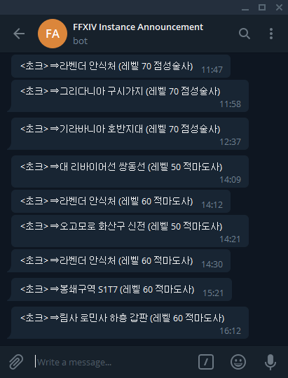

# ffxiv-instbot
[파판14](https://www.ff14.co.kr) 인게임 인스턴스 이동 알림봇

### 기능

> 현재 지역 이름을 오버레이로 보여줍니다

> 지역 이동시 미리 설정된 텔레그램 그룹으로 알림을 보내줍니다

### 사용법
1. [ACT](https://advancedcombattracker.com/) 실행
1. Plugins -> OverlayPlugin_64bit.dll -> New(추가)
1. Type(형식)을 `Log Parse`로 설정 (**중요**: ~~`Mini Parse`~~ 아님!) -> OK
1. 추가된 탭의 URL 칸에 `https://chalkpe.github.io/ffxiv-instbot/overlay` 입력

### 라이선스
[MIT License](LICENSE)